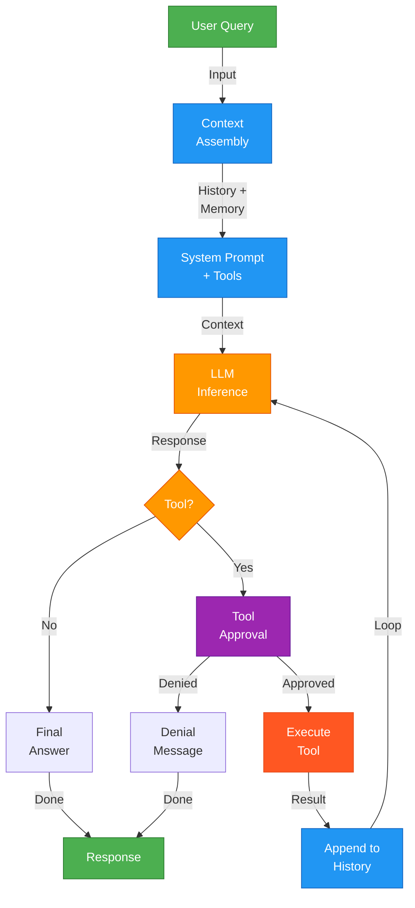
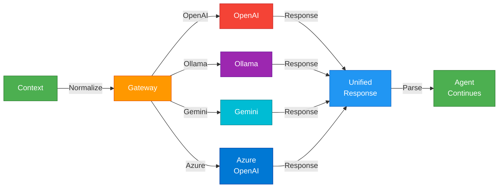
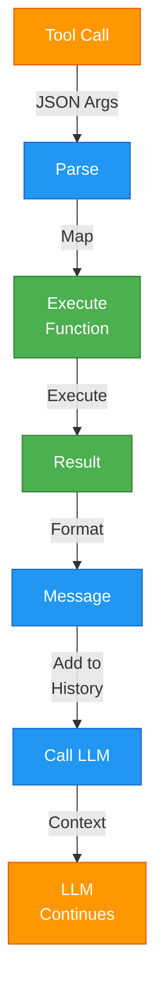
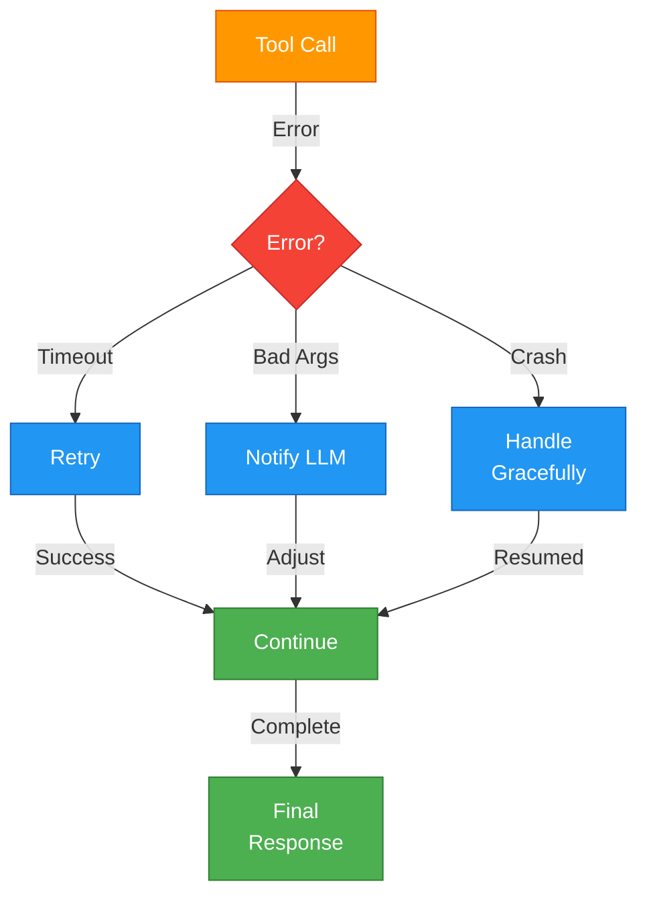

# Agent Architecture & Internal Workings

Understand what happens inside an agent from initialization to response.

---

## The Agent Execution Pipeline

When you call `agent.chat()`, here's what happens:



---

## Layer 1: Context Assembly

The agent gathers all relevant information before querying the LLM.

**What Gets Assembled:**
- **Session History**: All previous turns in the current conversation
- **Persistent Memory**: Semantic search results from stored knowledge
- **System Prompt**: The agent's role and instructions
- **Available Tools**: Formatted as JSON schemas

```python
# Your code:
response = await agent.chat("What's the weather in Seattle?")

# Internally, agent assembles:
context = {
    "system": "You are a Weather Assistant. Use check_weather to answer questions.",
    "history": [
        {"role": "user", "content": "What's the weather in Seattle?"}
    ],
    "tools": [
        {
            "type": "function",
            "function": {
                "name": "check_weather",
                "description": "Fetches current weather",
                "parameters": {...}
            }
        }
    ]
}
```

---

## Layer 2: LLM Inference

The provider normalizes context and sends to the LLM.



Each provider has different response formats. The **Provider Gateway** normalizes them so agent code never worries about provider differences.

---

## Layer 3: Tool Calling Decision

The LLM decides: Should I call a tool, or respond directly?

**Scenario 1: Direct Response**
```
User: "What is AI?"
LLM: "AI is artificial intelligence..."
Agent: Returns response (no tool needed)
```

**Scenario 2: Tool Call**
```
User: "What's the weather in Seattle?"
LLM: "I need to use check_weather"
Agent: Approves → Executes → Appends result to history
```

---

## Layer 4: Approval & Safety

Tools can be restricted using approval callbacks:

```python
async def approve_tool(session_id, tool_name, args):
    """
    session_id: Unique conversation identifier
    tool_name: Name of tool being called
    args: Arguments the LLM wants to pass
    """
    if tool_name == "delete_file":
        return False  # Deny dangerous operations
    if tool_name == "write_file":
        # Check the file path
        if "system32" in args.get("path", "").lower():
            return False
        return True
    return True  # Auto-approve others

agent.set_callbacks(on_tool_approval=approve_tool)
```

Or use auto-approval:

```python
agent.set_auto_approve_all(True)  # Approve all without callback
```

---

## Layer 5: Tool Execution

When approved, the agent executes your Python function:

```python
def check_weather(location: str, unit: str = "fahrenheit", **kwargs) -> dict:
    """Fetches weather data."""
    # Your implementation
    return {"temperature": 72, "conditions": "sunny"}

# LLM sends: {"location": "Seattle"}
# Agent calls: check_weather(location="Seattle")
# Result: {"temperature": 72, "conditions": "sunny"}
# Appends to conversation history as "tool" role message
```



---

## Multi-Turn Conversations

Agents automatically maintain context across multiple turns:

```python
agent = Agent(llm="ollama", tools=[check_weather])

# Turn 1
r1 = await agent.chat("What's the weather in Seattle?")
# History: [{"role": "user", "content": "...Seattle?"}]
#          [{"role": "assistant", "content": "..."}]

# Turn 2 - Previous conversation is in context
r2 = await agent.chat("How about New York?")
# History: [prev messages] 
#          [{"role": "user", "content": "...New York?"}]
#          [{"role": "assistant", "content": "..."}]

# Turn 3 - Agent has full context of both cities
r3 = await agent.chat("Which is warmer?")
# Agent can compare because it remembers both previous answers
```

---

## Memory Systems

Agents can access two types of memory:

### Session Memory
Automatic within the conversation:
```python
agent = Agent(llm="ollama")
await agent.chat("My name is Alice")
await agent.chat("What's my name?")
# Agent remembers: "Your name is Alice"
```

### Persistent Memory (with `memory=True`)
Stores and retrieves embeddings across sessions:
```python
agent = Agent(llm="ollama", memory=True)
await agent.chat("The capital of France is Paris")

# Later, in a new session:
agent2 = Agent(llm="ollama", memory=True)
await agent2.chat("Where is the capital of France?")
# Semantic search retrieves: "...Paris" from storage
```

---

## Streaming & Real-Time Feedback

Agents support token-level streaming for UIs:

```python
def on_token(token):
    print(token, end="", flush=True)  # Print as it arrives

response = await agent.chat(
    "Explain photosynthesis",
    callbacks={"on_token": on_token},
    stream=True
)
# Output: "Photo... syn... thesis... is... the..."
# (tokens printed in real-time)
```

Streaming happens at multiple levels:
- **Token streaming**: Raw LLM tokens
- **Tool execution**: Visible in debug logs
- **Full response**: Available once complete

---

## Error Handling & Recovery

Agents gracefully handle failures:



Common recovery strategies:
- **Retry**: Network timeouts, temporary failures
- **Fallback**: Provider unavailable → use backup provider
- **Graceful degradation**: Tool fails → inform LLM, continue
- **Max iterations**: Prevent infinite loops (default: 5)

---

## Configuration & Customization

Agents expose control at every level:

```python
agent = Agent(
    llm="ollama",                    # LLM provider
    model="qwen2:7b",                # Specific model
    tools=[check_weather, get_time],  # Available tools
    role="Weather Assistant",         # Identity
    system_message="Be concise...",   # Instructions
    memory=True,                      # Enable persistence
    max_iterations=10,                # Prevent loops
    debug=True,                       # Enable logging
    temperature=0.7,                  # Reasoning randomness
)

# Runtime customization
agent.set_auto_approve_all(True)
agent.set_callbacks(on_tool_approval=custom_approval_fn)
agent.load_skill("web_research")  # Add capabilities
```

---

## Next: Choose Your Agent Type

Ready to build? Pick the agent that fits your needs:

- **[BasicAgent](./basic-agent)** — Minimal setup for quick prototypes
- **[Agent](./full-agent)** — Full-featured with all capabilities
- **[SmartAgent](./smart-agent)** — Project-aware with built-in tools
- **[MCPAgent](../mcp/mcp-agent)** — Enterprise-scale with custom tools and governance
