# Reasoning & Thought Parsing

Logicore's reasoning system does two things automatically:

1. **Injects a reasoning system prompt** before every LLM call (`BEFORE_MODEL` hook).
2. **Reads the model's reasoning trace** after each response (`AFTER_MODEL` hook) and escalates or de-escalates the reasoning level for the next turn.

---

## How It Fits Together

```mermaid
graph LR
    BM["BEFORE_MODEL hook"] -->|Injects reasoning prompt| LLM["LLM call"]
    LLM -->|Raw response text| AM["AFTER_MODEL hook"]
    AM --> TP["ThoughtParser"]
    TP -->|complexity_score| RC["ReasoningController.adjust_for_response()"]
    RC -->|New level| NS["Next-turn system prompt"]

    style BM fill:#9C27B0,stroke:#6A1B9A,color:#fff
    style AM fill:#9C27B0,stroke:#6A1B9A,color:#fff
    style TP fill:#2196F3,stroke:#1565C0,color:#fff
    style RC fill:#FF9800,stroke:#E65100,color:#fff
    style LLM fill:#4CAF50,stroke:#2E7D32,color:#fff
```



---

## `ReasoningController`

Five reasoning levels, each with a richer system prompt:

| Level | Value | Description |
|---|---|---|
| `MINIMAL` | 0 | Single-sentence answer only |
| `BASIC` | 1 | Brief explanation (default) |
| `MODERATE` | 2 | Structured thinking before answer |
| `THOROUGH` | 3 | Full chain of thought |
| `COMPREHENSIVE` | 4 | Maximum depth reasoning |

### Wiring hooks

```python
from logicore.runtime.reasoning import ReasoningController, ReasoningLevel
from logicore.runtime.hooks import HookSystem

hooks = HookSystem()
controller = ReasoningController(level=ReasoningLevel.BASIC)

# Registers two hooks:
#   "reasoning_prompt_injection" — BEFORE_MODEL, priority=10
#   "reasoning_auto_adjust"      — AFTER_MODEL,  priority=50
controller.register_hooks(hooks)
```

### Manual control

```python
# Get the system prompt for the current level
prompt = controller.get_system_prompt()

# Adjust level based on response
new_level = controller.adjust_for_response(
    response_text="<thinking>...</thinking> After careful analysis...",
    complexity_threshold=0.5,   # escalate if score >= 0.5
)

# Inspect last analysis
analysis = controller.analyze_response(response_text)
# {"thought_count": 3, "complexity_score": 0.72, "subjects": ["Plan", "Risks"], ...}

# Change level directly
controller.set_level(ReasoningLevel.THOROUGH)
```

---

## `ThoughtParser`

Extracts structured reasoning from raw model text, regardless of format.

### Supported patterns

| Pattern | Example | `ThoughtType` |
|---|---|---|
| `**Subject**: description` | `**Plan**: First I will...` | `SUBJECT_DESCRIPTION` |
| `<thinking>...</thinking>` | Claude-style | `THINKING_BLOCK` |
| `[Thought]: ...` | Explicit markers | `EXPLICIT_MARKER` |
| `Step 1: ...` | Step sequences | `STEP_SEQUENCE` |
| `"Let me think"` / `"My reasoning"` | Chain-of-thought phrases | `CHAIN_OF_THOUGHT` |

### Usage

```python
from logicore.runtime.reasoning import ThoughtParser, parse_thoughts

# One-shot function
analysis = parse_thoughts(model_response_text)

print(analysis.thought_count)           # int
print(analysis.complexity_score)        # 0.0 – 1.0
print(analysis.has_structured_thinking) # bool
print(analysis.subjects)               # ["Plan", "Solution", ...]
print(analysis.clean_content)          # response text with thought markers stripped

for thought in analysis.thoughts:
    print(thought.thought_type, thought.subject, thought.description)
```

### Escalation check

```python
parser = ThoughtParser()
should_escalate = parser.should_escalate_reasoning(
    response_text,
    complexity_threshold=0.5,
)
```

### Complexity score components

| Component | Weight |
|---|---|
| Thought count (log scale) | 30 % |
| Thought type diversity | 20 % |
| Step sequences present | 20 % |
| Thinking block present | 20 % |
| Response length (log scale) | 10 % |

---

## Full Example

```python
import asyncio
from logicore.runtime.reasoning import ReasoningController, ReasoningLevel
from logicore.runtime.hooks import HookSystem

async def main():
    hooks = HookSystem()
    controller = ReasoningController(level=ReasoningLevel.BASIC)
    controller.register_hooks(hooks)

    # Simulate the BEFORE_MODEL hook populating the system prompt
    before_hook = controller.create_before_model_hook()
    from logicore.runtime.hooks.types import HookContext, HookPoint
    ctx = HookContext(hook_point=HookPoint.BEFORE_MODEL, messages=[], turn_number=1)
    before_result = await before_hook(ctx)
    print("System prompt injected:", bool(before_result.modified_messages))

    # Simulate the AFTER_MODEL hook reading a complex response
    complex_response_text = (
        "<thinking>This requires considering multiple approaches...</thinking>\n"
        "**Plan**: I will first analyse the constraints, then derive the solution.\n"
        "**Risks**: Edge cases exist for empty inputs.\n"
        "My reasoning: The optimal approach is dynamic programming.\n"
        "Step 1: Parse inputs. Step 2: Build table. Step 3: Trace back."
    )
    after_hook = controller.create_after_model_hook()
    from logicore.providers.gateway import NormalizedMessage
    ctx2 = HookContext(
        hook_point=HookPoint.AFTER_MODEL,
        messages=[],
        model_response=NormalizedMessage(role="assistant", content=complex_response_text),
        turn_number=1,
    )
    await after_hook(ctx2)

    print("New level:", controller.current_level.name)  # likely MODERATE or THOROUGH

asyncio.run(main())
```

---

## Notes

- Auto-escalation only escalates by **one level** per turn; de-escalation only drops by **one level** when the response is simple (score < 0.3).
- The `BEFORE_MODEL` hook fires at priority 10, so other hooks that modify messages and run at priority > 10 will override the injected prompt if desired.
- `ThoughtParser` does not call the LLM — it is pure regex pattern matching over the response string.
