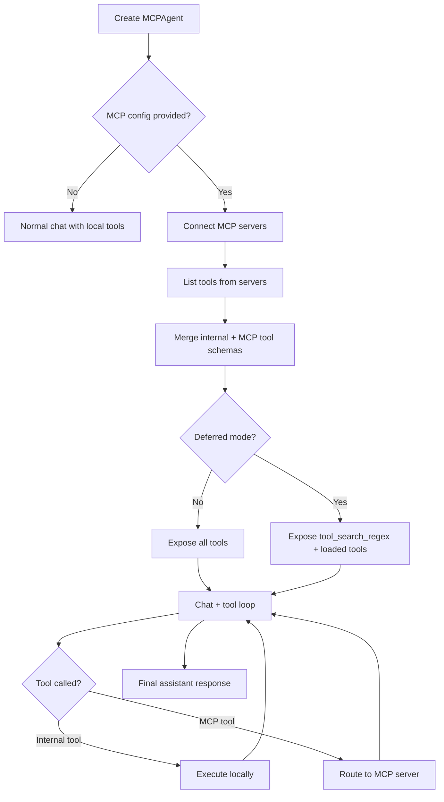

This page explains the runtime flow used by `MCPAgent` and `MCPClientManager`.

---

## End-to-End Flow

---

## Server Connection and Tool Discovery

`MCPClientManager.connect_to_servers()` does the following:
- Loads server config from `mcp.json`
- Starts stdio connections per server
- Initializes MCP sessions
- Calls `list_tools()` for each server
- Builds `server_tools_map` so a tool can be routed to the correct server

---

## Tool Execution Routing

When the model asks to call a tool:
- If it is an internal/local tool, execution stays in the base agent path
- If it is an MCP tool, `MCPClientManager.execute_tool()` looks up the owning server and calls `session.call_tool()`
- Result text is normalized and returned to the agent loop

This keeps a single chat surface while supporting mixed tool sources.

---

## Session Handling

`MCPAgent` adds lifecycle helpers on top of base sessions:
- `create_session()` / `destroy_session()`
- `list_sessions()`
- `cleanup_stale_sessions()` with timeout-based cleanup

This is useful for multi-tenant or long-running assistant backends.
