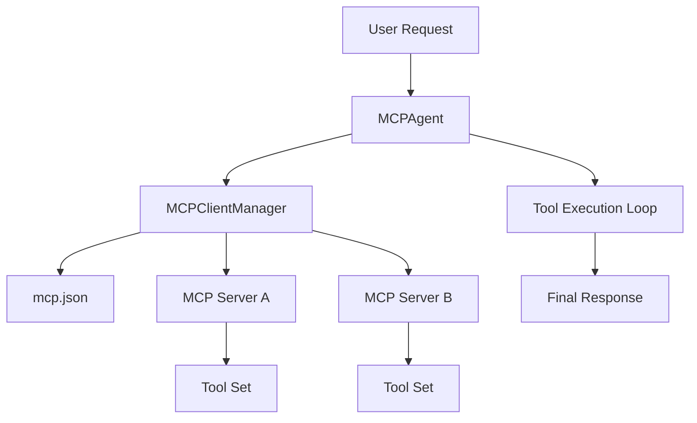

MCP (Model Context Protocol) in Logicore lets your agent connect to external tool servers and use those tools during chat.

At a high level, MCP gives you:
- A standard way to connect external tools
- Safe tool execution through the same approval model as internal tools
- Better scalability for large tool catalogs through deferred loading

---

## What MCP Adds Beyond Normal Tools

- **External tool servers** via `mcp.json` configuration
- **Tool discovery** across connected servers
- **Session-aware chat** with MCP tool execution
- **Dynamic tool exposure** when tool count is large

---

## MCP Concept Map

---

## Read Next

- [MCP Overview](./mcp-overview)
- [How MCP Works](./mcp-how-it-works)
- [Dynamic Tool Loading](./mcp-dynamic-tools)
- [MCP Examples](./mcp-examples)
