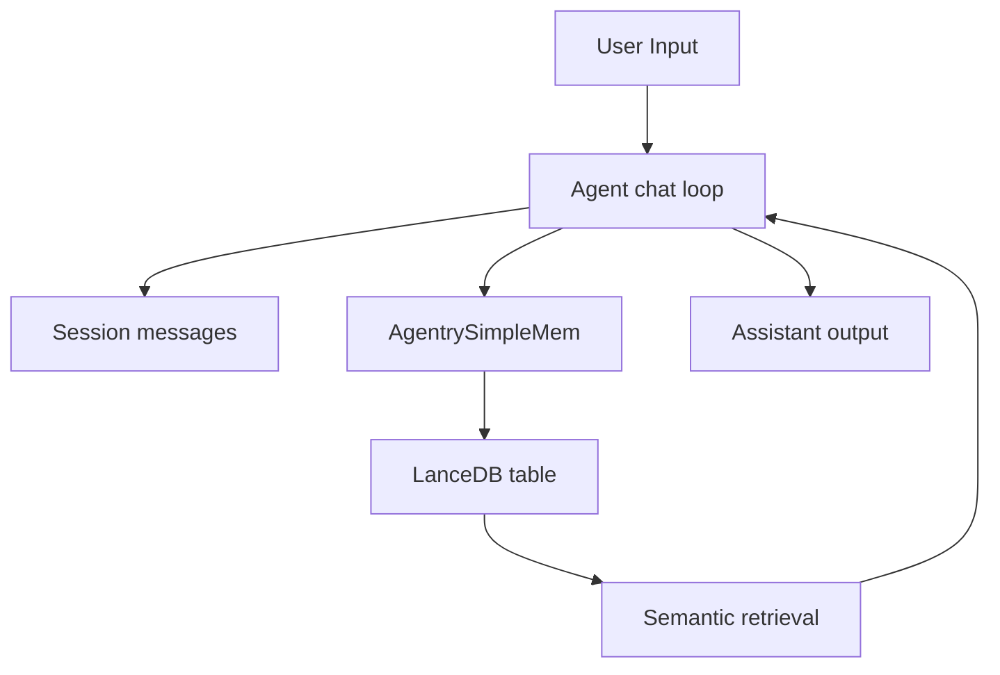

Logicore memory has two layers:
- Short-term memory for active session context
- Long-term memory through SimpleMem vector persistence

---

## Architecture Snapshot

---

## How the Two Layers Work Together

1. Session messages maintain immediate conversational continuity.
2. User and assistant turns are queued into SimpleMem when memory is enabled.
3. Relevant facts are embedded and persisted into LanceDB tables.
4. Retrieval can surface relevant memory snippets for future turns.

---

## Key Behavior in Current Implementation

- Session memory is always available per active session.
- SimpleMem persistence is enabled with `memory=True` on agent creation.
- Memory indexing is selective and score-based (small talk and transient chatter are filtered).
- By default, SimpleMem uses per-session table isolation.

---

## Next Pages

- [Short-Term Memory Handling](./memory-short-term)
- [Long-Term Memory Handling](./memory-long-term)
- [SimpleMem Integration for Persistence](./memory-simplemem-integration)
- [Use Memory in Agents](./memory-use-in-agents)
