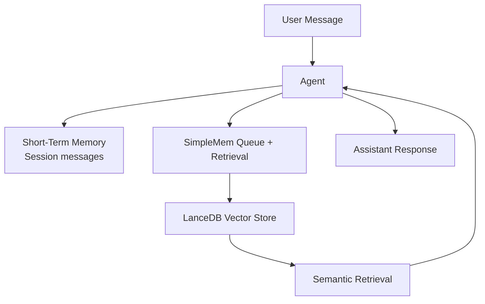

Memory in Logicore combines short-term conversation context with optional persistent memory.

At a high level, memory gives you:
- Per-session chat continuity through session history
- Optional durable memory through SimpleMem vector storage
- Retrieval-ready context when relevant to a new query

---

## Memory Concept Map

---

## Read Next

- [Memory Overview](./memory-overview)
- [Short-Term Memory Handling](./memory-short-term)
- [Long-Term Memory Handling](./memory-long-term)
- [SimpleMem Integration for Persistence](./memory-simplemem-integration)
- [Use Memory in Agents](./memory-use-in-agents)
