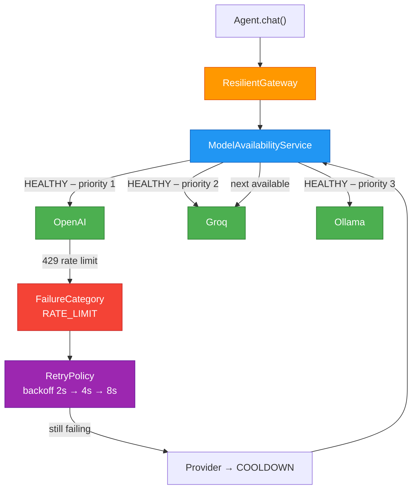

# Provider Resilience

Logicore's resilience layer lets you register N providers and have failover, retry, and health tracking happen automatically — no custom exception handling needed in your agent code.

---

## The Problem

A single-provider setup fails silently:
- OpenAI returns `429 Too Many Requests` → your agent crashes
- A deployment is deleted on Azure → every request 404s until you notice
- Network hiccup → single retry buries the error or propagates it up

---

## The Solution: `ModelAvailabilityService` + `ResilientGateway`



---

## Components

### `ModelAvailabilityService`

Tracks health per provider and owns the fallback chain.

```python
from logicore.providers import ModelAvailabilityService, AvailabilityConfig

config = AvailabilityConfig(
    failure_threshold=3,          # failures before COOLDOWN
    terminal_threshold=10,        # failures before TERMINAL (stop sending)
    base_cooldown_seconds=5.0,    # base; doubles each consecutive failure
    max_cooldown_seconds=300.0,   # cap at 5 minutes
)

availability = ModelAvailabilityService(config=config)
```

#### Registering providers

```python
from logicore.providers import OpenAIProvider, GroqProvider, OllamaProvider

availability.register_provider(
    "openai",                                              # unique ID
    OpenAIProvider(model_name="gpt-4o"),                  # provider instance
    priority=1,                                            # lower = higher priority
)
availability.register_provider("groq",   GroqProvider(model_name="llama-3.3-70b-versatile"), priority=2)
availability.register_provider("ollama", OllamaProvider(model_name="qwen2:7b"),              priority=3)
```

#### Health states

| State | Requests allowed? | Triggered by |
|---|---|---|
| `HEALTHY` | Yes | Default / successful request |
| `COOLDOWN` | After delay | Any retryable failure |
| `UNHEALTHY_RETRY` | Yes (limited) | Multiple failures below terminal threshold |
| `UNHEALTHY_TERMINAL` | **No** | Auth error, quota exceeded, model not found |

#### Querying state

```python
# Get best available provider right now
provider = availability.get_available_provider()

# Get ordered fallback list
chain = availability.get_fallback_chain()
# → ["openai", "groq", "ollama"]

# Per-provider stats
stats = availability.get_stats()
# {
#   "openai": {"state": "cooldown", "consecutive_failures": 3, "failure_rate": 0.12, ...},
#   "groq":   {"state": "healthy",  "consecutive_failures": 0, "failure_rate": 0.00, ...},
# }

# Manual override
availability.mark_healthy("openai")
availability.mark_terminal("ollama", reason="GPU offline")
```

#### State-change callbacks

```python
def on_change(provider_id, old_state, new_state):
    print(f"[{provider_id}] {old_state.value} → {new_state.value}")

availability.on_state_change(on_change)
```

---

### `RetryPolicy`

Controls retry behaviour per call.

```python
from logicore.providers import RetryPolicy, FailureCategory

policy = RetryPolicy(
    max_attempts=5,          # including the initial attempt
    base_delay=1.0,          # seconds before first retry
    max_delay=60.0,          # cap on wait time
    exponential_base=2.0,    # delay doubles each attempt: 1s → 2s → 4s → 8s
    jitter=0.1,              # ±10% random jitter to avoid thundering herd
)
```

#### What gets retried and what doesn't

| Category | Retry? | Notes |
|---|---|---|
| `RATE_LIMIT` | Yes | Extra 2× base delay |
| `NETWORK` | Yes | Standard backoff |
| `TIMEOUT` | Yes | Standard backoff |
| `SERVER_ERROR` | Yes | 2× base delay |
| `UNKNOWN` | Yes | Standard backoff |
| `AUTH` | **No** | Provider → TERMINAL immediately |
| `MODEL_NOT_FOUND` | **No** | Provider → TERMINAL immediately |
| `QUOTA_EXCEEDED` | **No** | Provider → TERMINAL immediately |
| `INVALID_REQUEST` | **No** | Not a transient error |

#### Convenience presets

```python
from logicore.providers import (
    DEFAULT_RETRY_POLICY,       # 5 attempts, 1s base
    AGGRESSIVE_RETRY_POLICY,    # 10 attempts, 0.5s base
    CONSERVATIVE_RETRY_POLICY,  # 3 attempts, 2s base
    NO_RETRY_POLICY,            # 1 attempt only
)
```

#### `@with_retry` decorator

Use when you want retry on any arbitrary async function:

```python
from logicore.providers import with_retry, RetryPolicy

@with_retry(policy=RetryPolicy(max_attempts=3, base_delay=0.5))
async def call_external_api():
    ...
```

---

### `ResilientGateway`

Wraps any single provider with retry + failover logic. Drop it in wherever you use a regular gateway.

```python
from logicore.providers import ResilientGateway, RetryPolicy

gateway = ResilientGateway(
    provider=availability.get_available_provider(),
    availability=availability,         # enables multi-provider failover
    retry_policy=RetryPolicy(max_attempts=5),
    enable_failover=True,              # try next provider after exhausting retries
    enable_stream_retry=True,          # retry on mid-stream failures
    max_stream_retries=3,              # max stream-level retries
)

# Same interface as ProviderGateway — nothing else changes
response = await gateway.chat(messages, tools=tools)
streamed  = await gateway.chat_stream(messages, tools=tools, on_token=cb)
```

---

## Full Example

```python
import asyncio
from logicore.providers import (
    ModelAvailabilityService, AvailabilityConfig,
    ResilientGateway, RetryPolicy,
    OpenAIProvider, GroqProvider, OllamaProvider,
    HealthState,
)

async def main():
    # --- Setup ---
    config = AvailabilityConfig(failure_threshold=2, base_cooldown_seconds=3.0)
    availability = ModelAvailabilityService(config=config)

    availability.register_provider("openai",  OpenAIProvider(model_name="gpt-4o"),               priority=1)
    availability.register_provider("groq",    GroqProvider(model_name="llama-3.3-70b-versatile"), priority=2)
    availability.register_provider("ollama",  OllamaProvider(model_name="qwen2:7b"),              priority=3)

    def on_change(pid, old, new):
        print(f"  [{pid}] {old.value} → {new.value}")

    availability.on_state_change(on_change)

    # --- Gateway ---
    gateway = ResilientGateway(
        provider=availability.get_available_provider(),
        availability=availability,
        retry_policy=RetryPolicy(max_attempts=5),
    )

    # --- Use it ---
    messages = [{"role": "user", "content": "Summarize the water cycle in 2 sentences."}]
    response = await gateway.chat(messages)
    print(response.content)

    # --- Inspect health ---
    for pid, stat in availability.get_stats().items():
        print(f"{pid}: {stat['state']} — failures={stat['total_failures']}")

asyncio.run(main())
```

---

## Notes

- `ResilientGateway` is backward-compatible with `ProviderGateway` — same `chat()` / `chat_stream()` interface.
- Terminal providers (bad key, quota) are never retried until you call `availability.mark_healthy(id)` or the optional 30-minute auto-recovery check runs.
- Call `await availability.start_health_checks()` to enable periodic recovery checks for terminal providers.
- All health data is in-process only — restart loses state. For persistent health, integrate `get_stats()` into your metrics store.
