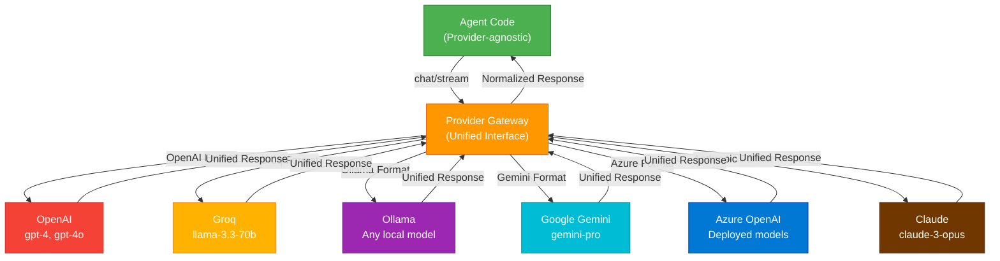
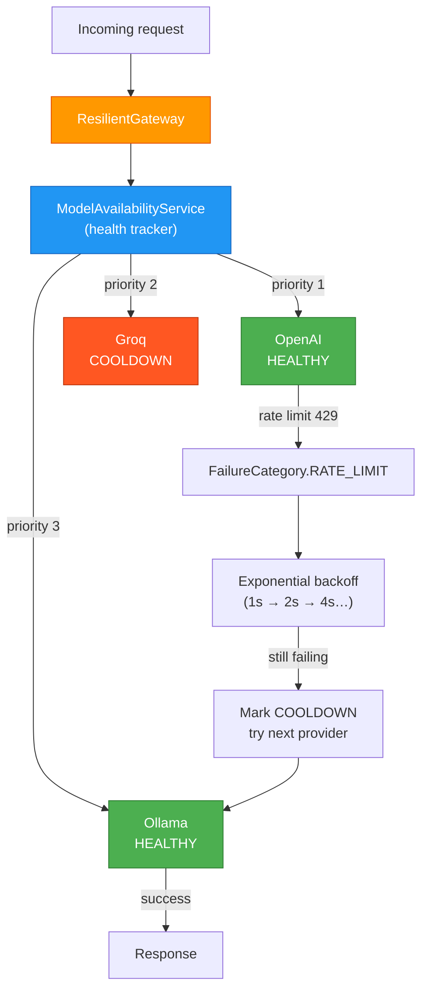

# Provider Architecture & Internal Workings

Logicore's **Provider Gateway** is the abstraction layer that normalizes all LLM vendors into a unified interface.

---

## The Provider Abstraction Layer



---

## How It Works

### 1. Provider Initialization
Each provider exposes the same interface:

```python
# All providers have the same initialization pattern
from logicore.providers import OpenAIProvider, GroqProvider, OllamaProvider

provider1 = OpenAIProvider(model="gpt-4o", api_key="sk-...")
provider2 = GroqProvider(model="llama-3.3-70b-versatile", api_key="gsk_...")
provider3 = OllamaProvider(model="qwen2:7b")

# All implement: send_message(), stream(), handle_tool_calls()
```

### 2. Request Normalization
Agent sends request in canonical format; Gateway converts to provider-specific format:

```
Agent Request (Canonical):
{
  "messages": [...],
  "tools": [...],
  "temperature": 0.7,
  "max_tokens": 2048
}

↓ Gateway Transforms ↓

OpenAI Format:
{
  "model": "gpt-4o",
  "messages": [...],
  "tools": [...],  # OpenAI tool_calls format
  "temperature": 0.7
}

Groq Format:
{
  "model": "llama-3.3-70b-versatile",
  "messages": [...],
  "tools": [...],  # Groq format (different structure)
  "temperature": 0.7
}

Ollama Format:
{
  "model": "qwen2:7b",
  "messages": [...],
  # Note: Ollama doesn't support tools natively
}
```

### 3. Response Normalization
Each provider returns different formats; Gateway normalizes to canonical:

```
OpenAI Response:
{
  "choices": [{
    "message": {
      "content": "...",
      "tool_calls": [{"type": "function", "function": {"name": "..."}}]
    }
  }]
}

Anthropic Response:
{
  "content": [{
    "type": "text",
    "text": "..."
  }],
  "stop_reason": "tool_use"
}

Ollama Response:
{
  "message": {
    "content": "..."
  }
}

↓ Gateway Normalizes ↓

Canonical Response (used by Agent):
{
  "role": "assistant",
  "content": "...",
  "tool_calls": [...],
  "stop_reason": "..."
}
```

---

## Provider Capabilities

Different providers have different capabilities:

| Capability | OpenAI | Groq | Ollama | Gemini | Azure | Anthropic |
|------------|--------|------|--------|--------|-------|-----------|
| **Tool Calling** | ✓ | ✓ | Limited | ✓ | ✓ | ✓ |
| **Vision/Images** | ✓ | | | ✓ | ✓ | ✓ |
| **Streaming** | ✓ | ✓ | ✓ | ✓ | ✓ | ✓ |
| **Function Calling** | ✓ | ✓ | Limited | ✓ | ✓ | ✓ |
| **Max Context** | 128K | 8K-10K | 8K-32K | 32K-100K | 128K | 200K |
| **Cost Efficiency** | Medium | Low | Free | Low-Medium | High | Medium-High |
| **Local Execution** | | | ✓ | | | |
| **Reasoning** | ✓ (limited) | | | ✓ | ✓ | ✓ |

Gateway detects capabilities and adapts behavior:

```python
if provider.supports_tool_calling:
    # Include tools in request
else:
    # Fallback: Ask LLM to generate tool calls as text
    
if provider.supports_vision:
    # Include images in request
else:
    # Fallback: Describe images in text
```

---

## Failover & Load Balancing

Agents can use multiple providers with automatic failover:

```python
agent = Agent(
    providers=[
        ("primary", OpenAIProvider(model="gpt-4o")),
        ("fallback", GroqProvider(model="llama-3.3-70b")),
        ("emergency", OllamaProvider(model="qwen2:7b"))
    ],
    failover="sequential"  # Try next on failure
)

# If OpenAI is down/rate-limited, try Groq
# If Groq is down, try Ollama locally
```

---

## Cost Optimization

Providers support cost tracking:

---

## Provider Health & Automatic Failover

Logicore ships a `ModelAvailabilityService` that tracks each provider's health in real time and resolves a priority-ordered fallback chain automatically.



### Health states

| State | Meaning | Requests allowed? |
|---|---|---|
| `HEALTHY` | No recent failures | Yes |
| `COOLDOWN` | Temporary failure; backoff active | Yes (after delay) |
| `UNHEALTHY_RETRY` | Multiple failures; retrying | Yes (limited) |
| `UNHEALTHY_TERMINAL` | Auth error / quota / model gone | No |

### Failure classification

`ModelAvailabilityService` auto-classifies every exception so retries are applied only where they help:

| Exception pattern | Category | Retry? |
|---|---|---|
| `429`, `rate limit` | `RATE_LIMIT` | Yes (extra backoff) |
| `401`, `403`, `Invalid API key` | `AUTH` | **No — terminal** |
| `404`, `model not found` | `MODEL_NOT_FOUND` | **No — terminal** |
| `500`, `502`, `503` | `SERVER_ERROR` | Yes |
| `connection refused`, `network` | `NETWORK` | Yes |
| `timeout`, `deadline` | `TIMEOUT` | Yes |
| `quota exceeded` | `QUOTA_EXCEEDED` | **No — terminal** |

### Quick setup

```python
from logicore.providers import (
    ModelAvailabilityService, AvailabilityConfig,
    ResilientGateway, RetryPolicy,
    OpenAIProvider, GroqProvider, OllamaProvider
)

config = AvailabilityConfig(
    failure_threshold=3,       # failures before COOLDOWN
    terminal_threshold=10,     # failures before TERMINAL
    base_cooldown_seconds=5.0, # grows exponentially per failure
)

availability = ModelAvailabilityService(config=config)
availability.register_provider("openai",  OpenAIProvider(model_name="gpt-4o"),               priority=1)
availability.register_provider("groq",    GroqProvider(model_name="llama-3.3-70b-versatile"), priority=2)
availability.register_provider("ollama",  OllamaProvider(model_name="qwen2:7b"),              priority=3)

# Optional: listen to state transitions
def on_state_change(provider_id, old_state, new_state):
    print(f"{provider_id}: {old_state.value} → {new_state.value}")

availability.on_state_change(on_state_change)

gateway = ResilientGateway(
    provider=availability.get_available_provider(),
    availability=availability,
    retry_policy=RetryPolicy(max_attempts=5, base_delay=1.0),
)

response = await gateway.chat(messages)
```

See [Provider Resilience](./provider-resilience.md) for the complete deep-dive.

---

## Custom Provider Implementation

Create custom providers for internal or proprietary APIs:

```python
from logicore.providers.base import LLMProvider, ProviderCapability

class InternalLLMProvider(LLMProvider):
    provider_name = "internal"
    _capabilities = {ProviderCapability.CHAT, ProviderCapability.STREAMING}

    def __init__(self, endpoint, api_key):
        self.endpoint = endpoint
        self.api_key = api_key
        self.model_name = "internal-model"
    
    def get_model_name(self):
        return self.model_name
    
    async def health_check(self) -> bool:
        # Optional: ping your internal endpoint
        return True

agent = Agent(llm=InternalLLMProvider(endpoint="...", api_key="..."))
```

`ProviderCapability` values: `CHAT`, `STREAMING`, `TOOLS`, `VISION`, `EMBEDDINGS`, `JSON_MODE`.

---

## Performance Characteristics

| Provider | Latency | Throughput | Reliability |
|----------|---------|-----------|-------------|
| **OpenAI** | 50-200ms | High | Excellent (99.99%) |
| **Groq** | 20-50ms | Excellent | Excellent (99.99%) |
| **Ollama** | 10-500ms* | Variable | High (local) |
| **Gemini** | 100-300ms | High | Excellent (99.9%) |
| **Azure** | 50-200ms | High | Excellent (99.99%) |
| **Anthropic** | 100-400ms | Medium | Excellent (99.9%) |

*Ollama depends on GPU/CPU; local execution has no network latency.

---

## Next Steps

- **[Providers Guide](./providers)** — Detailed provider setup
- **[Provider Resilience](./provider-resilience)** — Health tracking, retry, failover
- **[Agent Internals](../agents/agents-overview)** — How agents use providers
- **[API Reference](#)** — Provider methods and options
