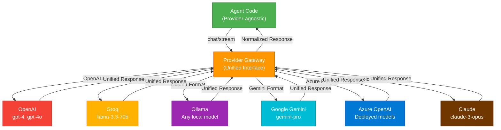

# Provider Architecture & Internal Workings

Logicore's **Provider Gateway** is the abstraction layer that normalizes all LLM vendors into a unified interface.

---

## The Provider Abstraction Layer



---

## How It Works

### 1. Provider Initialization
Each provider exposes the same interface:

```python
# All providers have the same initialization pattern
from logicore.providers import OpenAIProvider, GroqProvider, OllamaProvider

provider1 = OpenAIProvider(model="gpt-4o", api_key="sk-...")
provider2 = GroqProvider(model="llama-3.3-70b-versatile", api_key="gsk_...")
provider3 = OllamaProvider(model="qwen2:7b")

# All implement: send_message(), stream(), handle_tool_calls()
```

### 2. Request Normalization
Agent sends request in canonical format; Gateway converts to provider-specific format:

```
Agent Request (Canonical):
{
  "messages": [...],
  "tools": [...],
  "temperature": 0.7,
  "max_tokens": 2048
}

↓ Gateway Transforms ↓

OpenAI Format:
{
  "model": "gpt-4o",
  "messages": [...],
  "tools": [...],  # OpenAI tool_calls format
  "temperature": 0.7
}

Groq Format:
{
  "model": "llama-3.3-70b-versatile",
  "messages": [...],
  "tools": [...],  # Groq format (different structure)
  "temperature": 0.7
}

Ollama Format:
{
  "model": "qwen2:7b",
  "messages": [...],
  # Note: Ollama doesn't support tools natively
}
```

### 3. Response Normalization
Each provider returns different formats; Gateway normalizes to canonical:

```
OpenAI Response:
{
  "choices": [{
    "message": {
      "content": "...",
      "tool_calls": [{"type": "function", "function": {"name": "..."}}]
    }
  }]
}

Anthropic Response:
{
  "content": [{
    "type": "text",
    "text": "..."
  }],
  "stop_reason": "tool_use"
}

Ollama Response:
{
  "message": {
    "content": "..."
  }
}

↓ Gateway Normalizes ↓

Canonical Response (used by Agent):
{
  "role": "assistant",
  "content": "...",
  "tool_calls": [...],
  "stop_reason": "..."
}
```

---

## Provider Capabilities

Different providers have different capabilities:

| Capability | OpenAI | Groq | Ollama | Gemini | Azure | Anthropic |
|------------|--------|------|--------|--------|-------|-----------|
| **Tool Calling** | ✓ | ✓ | Limited | ✓ | ✓ | ✓ |
| **Vision/Images** | ✓ | | | ✓ | ✓ | ✓ |
| **Streaming** | ✓ | ✓ | ✓ | ✓ | ✓ | ✓ |
| **Function Calling** | ✓ | ✓ | Limited | ✓ | ✓ | ✓ |
| **Max Context** | 128K | 8K-10K | 8K-32K | 32K-100K | 128K | 200K |
| **Cost Efficiency** | Medium | Low | Free | Low-Medium | High | Medium-High |
| **Local Execution** | | | ✓ | | | |
| **Reasoning** | ✓ (limited) | | | ✓ | ✓ | ✓ |

Gateway detects capabilities and adapts behavior:

```python
if provider.supports_tool_calling:
    # Include tools in request
else:
    # Fallback: Ask LLM to generate tool calls as text
    
if provider.supports_vision:
    # Include images in request
else:
    # Fallback: Describe images in text
```

---

## Failover & Load Balancing

Agents can use multiple providers with automatic failover:

```python
agent = Agent(
    providers=[
        ("primary", OpenAIProvider(model="gpt-4o")),
        ("fallback", GroqProvider(model="llama-3.3-70b")),
        ("emergency", OllamaProvider(model="qwen2:7b"))
    ],
    failover="sequential"  # Try next on failure
)

# If OpenAI is down/rate-limited, try Groq
# If Groq is down, try Ollama locally
```

---

## Cost Optimization

Providers support cost tracking:

```python
agent = Agent(llm="openai")

response = await agent.chat("explain quantum computing")

print(f"Input tokens: {response['tokens']['input']}")
print(f"Output tokens: {response['tokens']['output']}")
print(f"Estimated cost: ${response['cost_estimate']}")
```

---

## Custom Provider Implementation

Create custom providers for internal or proprietary APIs:

```python
from logicore.providers.base import LLMProvider

class InternalLLMProvider(LLMProvider):
    def __init__(self, endpoint, api_key):
        self.endpoint = endpoint
        self.api_key = api_key
        self.model_name = "internal-model"
    
    async def send_message(self, messages, tools=None, **kwargs):
        # Transform messages to internal format
        # Send to internal API
        # Normalize response to canonical format
        return {
            "role": "assistant",
            "content": response_text,
            "tool_calls": tool_calls
        }
    
    async def stream(self, messages, tools=None, **kwargs):
        # Iterator that yields tokens
        async for token in stream_from_internal_api(...):
            yield token

agent = Agent(llm=InternalLLMProvider(endpoint="...", api_key="..."))
```

---

## Performance Characteristics

| Provider | Latency | Throughput | Reliability |
|----------|---------|-----------|-------------|
| **OpenAI** | 50-200ms | High | Excellent (99.99%) |
| **Groq** | 20-50ms | Excellent | Excellent (99.99%) |
| **Ollama** | 10-500ms* | Variable | High (local) |
| **Gemini** | 100-300ms | High | Excellent (99.9%) |
| **Azure** | 50-200ms | High | Excellent (99.99%) |
| **Anthropic** | 100-400ms | Medium | Excellent (99.9%) |

*Ollama depends on GPU/CPU; local execution has no network latency.

---

## Next Steps

- **[Providers Guide](./providers)** — Detailed provider setup
- **[Agent Internals](../agents/agents-overview)** — How agents use providers
- **[API Reference](#)** — Provider methods and options
