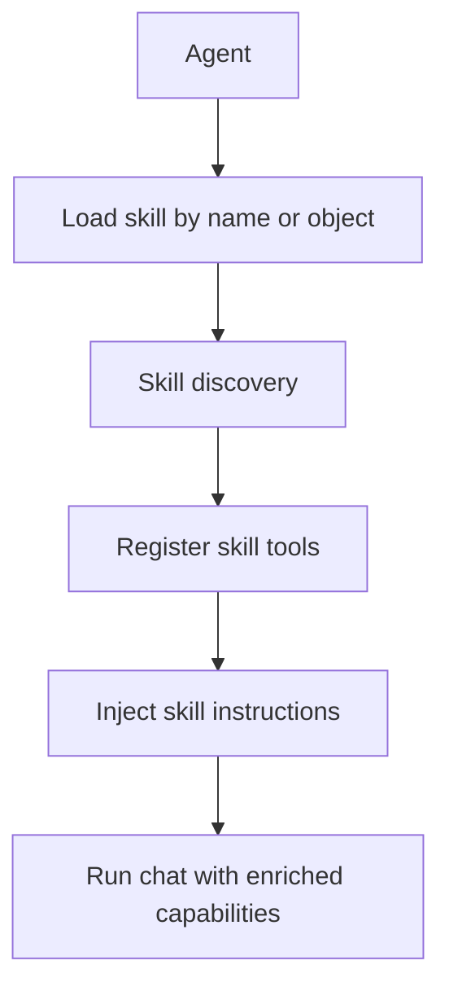
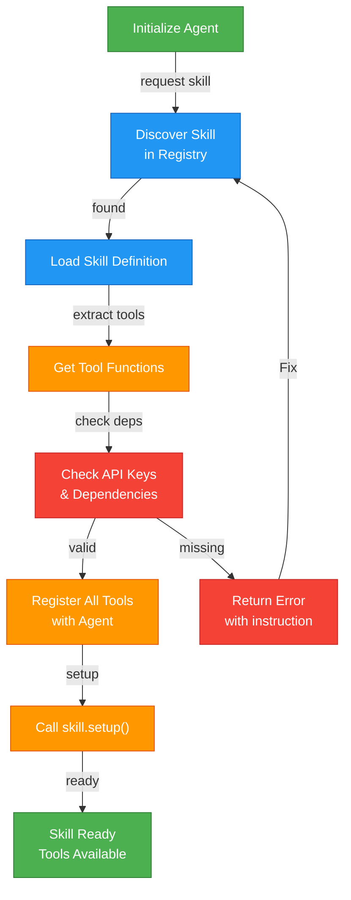

Skills are reusable capability packages that combine:
- Instructions from `SKILL.md`
- Tool schemas discovered from Python scripts
- Optional metadata like tags and dependencies

---

## What You Get with Skills



---

## Typical Use Cases

- Domain-specific assistants (support, analysis, research)
- Reusable team conventions and guardrails
- Faster setup for agents that need the same capability bundle

---

## Quick Start

```python
from logicore.agents.agent import Agent

agent = Agent(
    llm="ollama",
    tools=True,
    skills=["web_research"]
)

response = await agent.chat("Find and summarize updates on AI safety")
print(response)
```

---
# Good - agent knows what to expect
agent.load_skill("code_review")  # Specific skill

# Less optimal - might load more than needed
agent.load_skill("all_developer_tools")  # Broad skillset
```

### 3. Combine Complementary Skills
```python
# Good - well-rounded data team
agent = Agent(skills=[
    "web_research",     # Get data
    "data_analysis",    # Process data
    "visualization",    # Present data
    "database_ops"      # Store data
])

# Less optimal - conflicting tools
agent = Agent(skills=[
    "delete_everything",  # Dangerous
    "code_review",        # Safe
])
```

---

## Skill Lifecycle



---


## Next Pages

- [Why Skills Are Important](./skills-why-important)
- [Build Custom Skills](./skills-build-custom)
- [Use Custom Skills in Agents](./skills-use-in-agents)
- [Skills Working Internals](./skills-working-internals)
