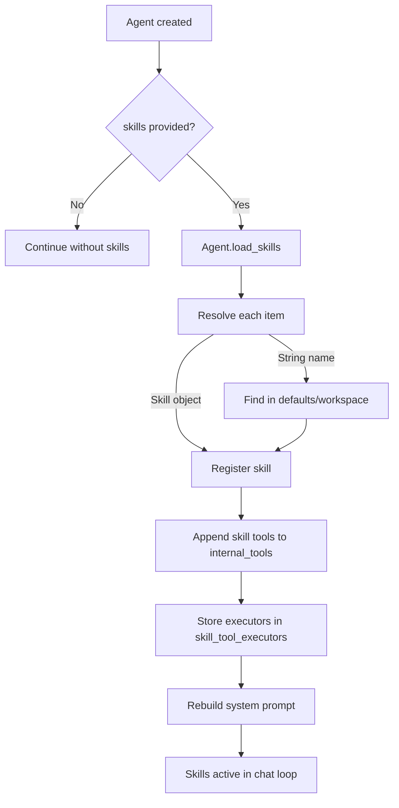

This page describes the actual runtime internals used by `SkillLoader` and `Agent`.

---

## Internal Flow



---

## 1) Parsing `SKILL.md`

`SkillLoader._parse_skill_md()` reads:
- YAML frontmatter metadata
- Remaining markdown as skill instructions

Metadata is converted to `SkillMetadata` and attached to `Skill`.

---

## 2) Discovering Tool Functions

For each Python file in `scripts/`:
- Module is imported dynamically
- Public functions with docstrings are treated as tools
- Signature/type hints are converted into function parameter schema
- Schema + callable are returned as `(name, func, schema)`

This becomes:
- `Skill.tools` (schema list)
- `Skill.tool_executors` (runtime function map)

---

## 3) Registering Skills in Agent

`Agent._register_skill()` does the following:
- Prevents duplicates by skill name
- Appends skill to `self.skills`
- Appends each skill tool schema to `self.internal_tools`
- Adds callable executors into `self.skill_tool_executors`
- Marks `supports_tools=True` if skill has tools

---

## 4) Prompt Injection

`Agent._build_skills_prompt_section()` formats loaded skills into:

```text
<skills>
### Skill: ...
...
</skills>
```

Then `_rebuild_system_prompt_with_tools()` appends this section to the system prompt so the model can follow skill instructions.

---

## 5) Workspace Discovery Paths

When loading by name and `workspace_root` is set, `SkillLoader.discover_workspace_skills()` searches:
- `.agent/skills/`
- `_agent/skills/`
- `.agents/skills/`
- `_agents/skills/`

This enables project-local skill bundles without editing package code.

---

## Runtime Outcome

After loading, skills behave as first-class capabilities in the same tool-calling loop used by the agent.
