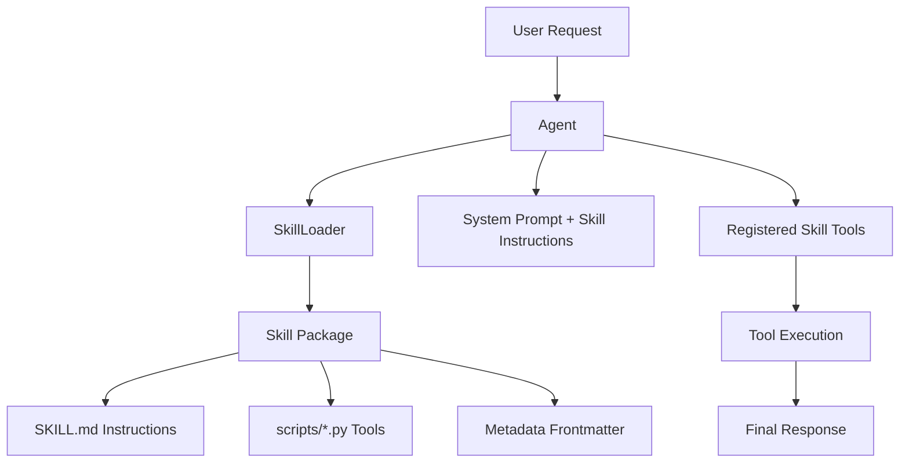

Skills in Logicore package instructions + tools into reusable capability modules.

At a high level, skills give you:
- Reusable domain behavior without repeating prompts
- Structured tool bundles loaded in one step
- Cleaner agent configuration for production use

---

## Skill Concept Map

---

## Read Next

- [Skills Overview](./skills-overview)
- [Why Skills Are Important](./skills-why-important)
- [Build Custom Skills](./skills-build-custom)
- [Use Custom Skills in Agents](./skills-use-in-agents)
- [Skills Working Internals](./skills-working-internals)
