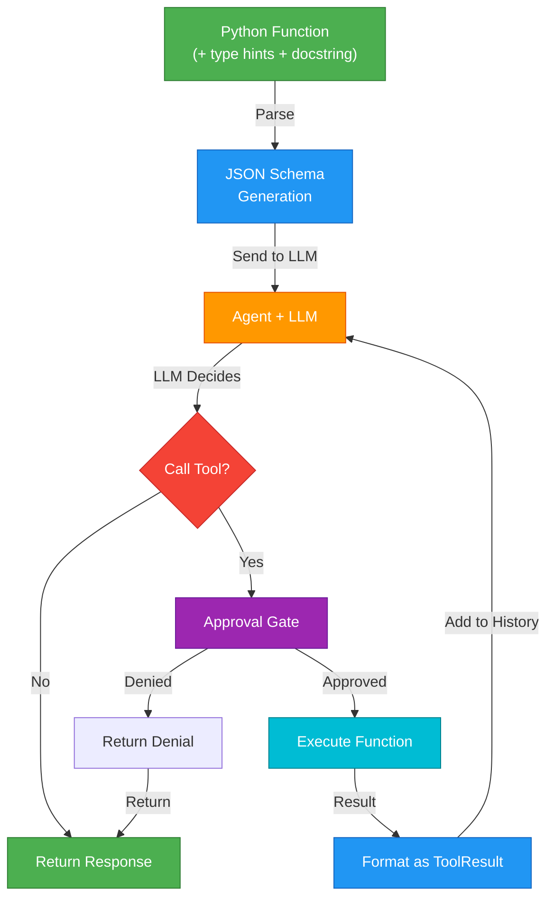
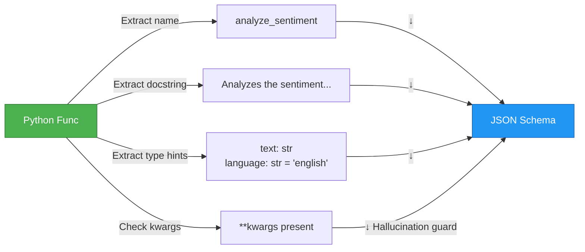

Tools are the bridge between LLM reasoning and executable Python code. Logicore automatically converts Python functions into LLM-callable tools.

---

## The Tool Execution Pipeline



---

## 1. Automatic Schema Generation

Logicore converts Python functions to JSON schemas the LLM understands:

### Input: Python Function
```python
def analyze_sentiment(text: str, language: str = "english", **kwargs) -> str:
    """
    Analyzes the sentiment of a text passage.
    
    Args:
        text (str): The text to analyze for sentiment.
        language (str): The language code (english, spanish, french, etc).
    
    Returns:
        str: One of 'positive', 'negative', or 'neutral'
    """
    # Implementation
    return "positive"
```

### Output: JSON Schema (sent to LLM)
```json
{
  "type": "function",
  "function": {
    "name": "analyze_sentiment",
    "description": "Analyzes the sentiment of a text passage.",
    "parameters": {
      "type": "object",
      "properties": {
        "text": {
          "type": "string",
          "description": "The text to analyze for sentiment."
        },
        "language": {
          "type": "string",
          "description": "The language code (english, spanish, french, etc).",
          "default": "english"
        }
      },
      "required": ["text"]
    }
  }
}
```

### Extraction Process



**What Gets Extracted:**
- **Name**: Function name → `"name"` field
- **Docstring**: Full docstring → `"description"` field
- **Type hints**: `str`, `int`, `bool`, `List[x]` → JSON types
- **Defaults**: `param = "value"` → `"default"` + `required` list
- `**kwargs`: Absorbs hallucinated parameters (local models are prone to this)

---

## 2. Tool Registration

Tools are registered before chat begins:

There are two primary built-in registration paths in this repo:
- **Default registry path** (`logicore/tools/registry.py`): loaded via `ALL_TOOL_SCHEMAS` when `tools=True` or `load_default_tools()` is used.
- **Smart Agent path** (`logicore/tools/agent_tools.py`): loaded by `SmartAgent` through `get_smart_agent_tools()` with a curated subset.

### During Initialization
```python
def multiply(a: int, b: int) -> int:
    """Multiply two numbers."""
    return a * b

def add(a: int, b: int) -> int:
    """Add two numbers."""
    return a + b

agent = Agent(
    llm="ollama",
    tools=[multiply, add]  # List of functions
)
```

### Runtime Registration
```python
agent = Agent(llm="ollama")
agent.register_tool_from_function(multiply)
agent.register_tool_from_function(add)
```

### Internal Storage
```python
# Logicore stores both schema and executor
agent.internal_tools = [
    {
        "type": "function",
        "function": {
            "name": "multiply",
            "description": "Multiply two numbers.",
            "parameters": {...}
        }
    },
    {
        "type": "function",
        "function": {
            "name": "add",
            ...
        }
    }
]

agent.custom_tool_executors = {
    "multiply": multiply,  # Actual function reference
    "add": add
}
```

---

## 3. Tool Calling Decision

The LLM decides when to call a tool:

### Decision Flow
```
LLM Sees:
- User: "What's 2 × 3 + 5?"
- Available tools: [multiply, add]
- System: "Use tools to perform calculations accurately"

LLM Reasoning:
"The user wants me to:
1. Multiply 2 × 3 = 6
2. Add 6 + 5 = 11

I should call these tools to get exact results."

LLM Response:
{
  "role": "assistant",
  "content": "",
  "tool_calls": [
    {
      "id": "call_1",
      "type": "function",
      "function": {
        "name": "multiply",
        "arguments": {"a": 2, "b": 3}
      }
    }
  ]
}
```

### Safety: Approval Gate
Before executing, check approval:

```python
async def approve_tool(session_id, tool_name, args):
    """
    Logicore asks: "Should I call this tool?"
    Return True = execute, False = deny, tell LLM why
    """
    if tool_name == "delete_file":
        return False  # Never delete without confirmation
    
    if tool_name == "write_file":
        path = args.get("path", "")
        if "/etc/" in path or "C:\\Windows" in path:
            return False  # Prevent system writes
        return True
    
    return True  # Allow others

agent.set_callbacks(on_tool_approval=approve_tool)
```

---

## 4. Tool Execution

Approved tools are executed:

### Execution
```python
# LLM sends: {"name": "multiply", "arguments": {"a": 2, "b": 3}}

# Logicore:
1. Looks up executor: agent.custom_tool_executors["multiply"]
2. Parses arguments: JSON → Python dict
3. Calls function: multiply(a=2, b=3)
4. Captures result: 6
5. Formats as tool result: {
     "role": "tool",
     "content": "6",
     "tool_call_id": "call_1",
     "name": "multiply"
   }
6. Appends to conversation history
7. Sends back to LLM: "Here's the result of multiply(2, 3) = 6"
```

### Error Handling
```
If tool raises exception:

try:
    result = multiply(a=2, b=3)
except Exception as e:
    result = f"ERROR: {str(e)}"
    
# Send error back to LLM
{
  "role": "tool",
  "content": "ERROR: ...",
  "tool_call_id": "call_1"
}

LLM sees error and adjusts its approach
```

---

## 5. Multi-Turn Tool Usage

Tools work across multiple turns:

```
Turn 1:
User: "What's 2 × 3?"
LLM: Calls multiply(2, 3) → 6

Turn 2:
User: "Now add 5"
LLM: Has context of previous call. Calls add(6, 5) → 11

Turn 3:
User: "Multiply by 2"
LLM: Calls multiply(11, 2) → 22
     (Remembers all previous results)
```

---

## Best Practices for Tool Design

### 1. Clear Docstrings
```python
# Good
def analyze_code(code: str, language: str = "python") -> str:
    """
    Analyzes source code for bugs and improvements.
    
    Args:
        code (str): The source code to analyze.
        language (str): Programming language (python, javascript, java, etc).
    
    Returns:
        str: Analysis report with findings and recommendations.
    """

# Bad
def analyze_code(code, language="python"):
    """Analyze code."""
```

### 2. Include **kwargs
```python
# Good - handles hallucinated parameters
def check_weather(location: str, **kwargs) -> str:
    return f"Weather in {location}: 72°F"

# Bad - crashes if LLM adds extra params
def check_weather(location: str) -> str:
    return f"Weather in {location}: 72°F"
```

### 3. Sensible Defaults
```python
# Good
def search(query: str, num_results: int = 10, language: str = "en") -> list:
    """Search for information."""

# Less flexible
def search(query: str) -> list:
    """Search for information."""
```

### 4. Return Serializable Types
```python
# Good
def get_data() -> dict:
    return {"status": "ok", "count": 42}

# Bad - can't JSON serialize custom objects
def get_data() -> MyCustomClass:
    return MyCustomClass()
```

---

## Tool Performance

| Operation | Time |
|-----------|------|
| Schema generation (per tool) | &lt;1ms |
| Tool selection (LLM decides) | 50-200ms (network bound) |
| Execution | Depends on tool (usually &lt;100ms) |
| Result formatting | &lt;1ms |
| **Total (one tool call)** | ~100-300ms |

---

## Advanced: Conditional Tool Loading

Only load tools when relevant:

```python
agent = Agent(llm="ollama")

# Load tools conditionally
if user_role == "admin":
    agent.register_tool_from_function(delete_file)
    agent.register_tool_from_function(restart_service)

agent.register_tool_from_function(check_status)  # Always available
```

---

## Next Steps

- **[Tools Overview](./tools.md)** — Entry point and reading path
- **[Ways of Making Tools](./tools-ways.md)** — Implementation patterns with examples
- **[Built-in Tools](./tools-built-in.md)** — Default tools and usage
- **[Custom Tools](./tools-custom.md)** — Authoring guidance and best practices
