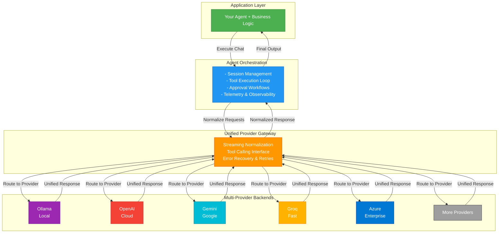

## Welcome to Logicore: The Unified AI Agent Framework

**Logicore** is an enterprise-grade Python framework for building intelligent, autonomous AI agents that work seamlessly across any LLM provider—whether local (Ollama), cloud-based (OpenAI, Gemini, Azure), or hybrid. It combines elegant abstractions with raw power, enabling developers to focus on business logic rather than provider-specific plumbing.

Built for production environments, Logicore handles the complexity of multi-provider LLM integration, tool execution, memory persistence, and workflow automation—**all with zero vendor lock-in**.

---

## What is Logicore?

Logicore is a **unified agentic framework** that abstracts away the fragmentation in the AI ecosystem. Instead of rewriting your agent logic for each LLM provider, you write once and deploy everywhere.

### The Problem Logicore Solves

| Challenge | Traditional Approach | Logicore Solution |
|-----------|----------------------|-------------------|
| **Provider Lock-in** | Choose OpenAI = rewrite for Gemini = rewrite for Ollama | Write once, swap providers with a single parameter |
| **Tool Complexity** | Manual JSON schema generation, parameter validation, error handling | Auto-generate schemas from Python docstrings & type hints |
| **Token Management** | Manual streaming, no reasoning extraction | Native streaming with hidden reasoning token extraction |
| **Memory Systems** | DIY vector DBs, RAG pipelines, session management | Built-in persistent memory with semantic search |
| **Scheduling** | External cron, Celery, AWS Lambda dependencies | Native agent-aware cron scheduler |
| **Approval & Safety** | Custom approval workflows, tool restriction layers | Declarative approval system with auto-approval APIs |

---

## Core Capabilities at a Glance

### 1. **Multi-Provider Agent Orchestration**
```python
# Switch providers without changing agent logic
agent = Agent(llm="ollama")        # Local execution
agent = Agent(llm="openai")        # Cloud execution
agent = Agent(llm="gemini")        # Google's model
agent = Agent(llm="groq")          # Fast inference
```
Your agent code remains **100% identical** across all providers.

### 2. **Zero-Config Tool Integration**
Convert any Python function to an LLM-callable tool automatically:

```python
def analyze_code(code: str, language: str = "python") -> str:
    """Analyzes code for bugs and improvements.
    
    Args:
        code: The source code to analyze
        language: Programming language (python, javascript, etc)
    
    Returns:
        Analysis report with findings
    """
    # Your implementation
    return analysis_result

agent.register_tool_from_function(analyze_code)
```
Logicore automatically:
- Parses type hints → JSON schemas
- Extracts docstrings → descriptions
- Validates parameters → error resilience
- Handles `**kwargs` → hallucination-proof execution

### 3. **Native Streaming with Reasoning Extraction**
Get real-time token updates **plus** hidden reasoning:

```python
async def on_token(token):
    print(token, end="", flush=True)

response = await agent.chat(
    "What's 2 + 2?",
    callbacks={"on_token": on_token},
    stream=True
)

# Output:
# <think>This is a simple arithmetic problem...</think>
# The answer is 4
```

### 4. **Persistent Memory & RAG**
Agents remember context across sessions:

```python
agent = Agent(
    llm="ollama",
    memory=True  # Enable persistent memory
)

await agent.chat("My name is Alice")
await agent.chat("What's my name?")
# Agent remembers: "Your name is Alice"
```

### 5. **Built-in Task Scheduling**
Let agents schedule their own background jobs:

```python
agent.add_tool(add_cron_job)  # Automatic scheduler
await agent.chat("Remind me to check emails every day at 9 AM")
```

### 6. **Skills & Pre-built Capabilities**
Load domain-specific skill packs instantly:

```python
agent.load_skill("web_research")    # Web + search tools
agent.load_skill("code_review")     # Code analysis tools
agent.load_skill("file_manipulation") # File I/O tools
```

### 7. **Flexible Approval & Safety**
Control tool execution with granular approval policies:

```python
# Option 1: Auto-approve all tools
agent.set_auto_approve_all(True)

# Option 2: Custom approval callback
async def approve_tool(session_id, tool_name, args):
    if tool_name == "delete_file":
        return False  # Deny dangerous operations
    return True  # Auto-approve everything else

agent.set_callbacks(on_tool_approval=approve_tool)
```

---

## Architecture Overview

### Layered Design for Extensibility



### Key Architectural Principles

| Principle | Implementation |
|-----------|-----------------|
| **Single Responsibility** | Each component has one job; composition over inheritance |
| **Provider Agnosticism** | Logic never assumes provider APIs; abstractions hide details |
| **Fail-Safe Execution** | Errors in tools don't crash agents; graceful degradation |
| **Transparency** | Full execution logs, telemetry, and debugging hooks |
| **Extensibility** | Skills, custom tools, middleware, and callbacks everywhere |

---

## Advantages Over Competitors

### vs. **LangChain**
- **Simpler API**: Less boilerplate, more intuitive
- **Native Streaming**: Built-in, not an afterthought
- **Zero Vendor Lock-in**: LangChain favors OpenAI
- **Type-Safe Tools**: Auto-schema from Python typehints, not manual YAML

### vs. **AutoGen**
- **Lightweight**: No complex role definitions; agent = logic
- **Real-time Streaming**: Full token-level feedback
- **Multi-Provider Native**: AutoGen biased toward Azure/OpenAI
- **Better Memory**: Semantic search + vector DB built-in

### vs. **OpenAI Assistants API**
- **Open-Source & Local**: Not locked to OpenAI infrastructure
- **Full Control**: Agents run in your process, not cloud
- **Cost Predictable**: No per-API-call billing; use any provider
- **Instant Feedback**: Streaming at the token level
- **Custom Logic**: Agents execute Python directly, not sandboxed

### vs. **Hugging Face Transformers Agents**
- **Production-Ready**: Battle-tested error handling & recovery
- **Cloud Models Supported**: Not just local transformers
- **State Management**: Multi-session, persistent memory
- **Observability**: Telemetry, execution logs, debugging

---

## Core Development Possibilities

### 1. **Custom Agents for Verticals**
Build domain-specific agents:
- **Data Analysis Agent**: SQL, pandas, visualization
- **Research Agent**: Web scraping, paper analysis, synthesis
- **DevOps Agent**: AWS/Azure API calls, log analysis, auto-remediation
- **Customer Support Agent**: Ticketing, FAQ lookup, escalation

### 2. **Multi-Agent Teams**
Orchestrate teams of specialized agents:
```python
researcher = Agent(role="Researcher", skills=["web_research"])
coder = Agent(role="Developer", skills=["code_generation"])
reviewer = Agent(role="Code Reviewer", skills=["code_review"])

# Agents hand off tasks to each other
```

### 3. **Real-Time Dashboards**
Stream agent reasoning to UIs:
```python
async def on_token(token):
    await websocket.send_json({"token": token})

await agent.chat(user_query, callbacks={"on_token": on_token})
```

### 4. **Autonomous Workflows**
Agents schedule and execute recurring tasks:
```python
# Agent schedules its own jobs
await agent.chat("Check my email every 10 minutes and summarize new messages")
```

### 5. **Knowledge Bases & RAG**
Build retrieval-augmented agents:
```python
agent = Agent(memory=True)
agent.add_tool(search_knowledge_base)  # Custom RAG tool
agent.add_tool(update_knowledge_base)  # Learning tool
```

### 6. **Multi-Provider Load Balancing**
Route requests intelligently:
```python
agent = Agent(llm="ollama")  # Fast, cheap, local
if ollama.is_busy():
    agent = Agent(llm="groq")  # Fallback to cloud
```

### 7. Observability & Compliance
Full audit trails for regulated industries:
```python
agent.telemetry_enabled = True
logs = agent.telemetry  # All execution data
compliance_report = generate_audit_report(logs)
```

---

## Why Logicore Scales

### Design for Growth
- **Async/Await Native**: Handle hundreds of concurrent agents
- **Pluggable Storage**: Use Redis, PostgreSQL, or in-memory
- **Extensible Middleware**: Add custom logging, monitoring, auth
- **Provider-Agnostic**: Switch to faster/cheaper provider without refactoring

### Performance Characteristics
| Scenario | Performance |
|----------|-------------|
| **Token Streaming** | &lt;50ms latency (network-bound) |
| **Tool Execution** | ~1ms overhead per tool call |
| **Multi-Session** | Linear scaling; 100s of sessions/process |
| **Memory Lookups** | &lt;10ms for semantic search on 10K embeddings |

---

## Built for Production

**Type-Safe**: Full type hints, validation, error messages
**Observable**: Telemetry, execution logs, debug modes
**Resilient**: Retry logic, fallbacks, graceful degradation
**Secure**: Input validation, tool approval workflows, prompt injection resistance
**Testable**: Mock providers, deterministic execution
**Documented**: Comprehensive guides, API docs, examples

---

## Real-World Use Cases

- **Enterprise Automation**: Schedule meetings, manage calendar, handle emails
- **DevOps & Infrastructure**: Monitor systems, auto-heal failures, generate reports
- **Customer Support**: Route tickets, suggest solutions, escalate intelligently
- **Content Creation**: Research, draft, review, publish workflows
- **Data Analysis**: Query databases, generate reports, visualize insights
- **Financial Analysis**: Market data analysis, portfolio management, risk assessment
- **Healthcare**: Clinical decision support, patient communication (with guardrails)
- **Legal Services**: Document review, contract analysis, case research

---

## Getting Started

Ready to build? Jump to:
- **[Installation Guide](./installation)** — Set up in 2 minutes
- **[Quickstart Tutorial](./quickstart)** — Build your first agent
- **[Agent Concepts](./concepts/agents)** — Deep dive into architecture
- **[API Reference](./concepts/)** — Complete API documentation

---

## Support & Feedback

- **[Report an Issue](https://github.com/rudramodi360/Agentry/issues)** — Found a bug or want a feature?
- **[Discussions](https://github.com/rudramodi360/Agentry/discussions)** — Share ideas and ask questions
- **[Contributing](./resources/contribution-guide)** — Help improve Logicore

